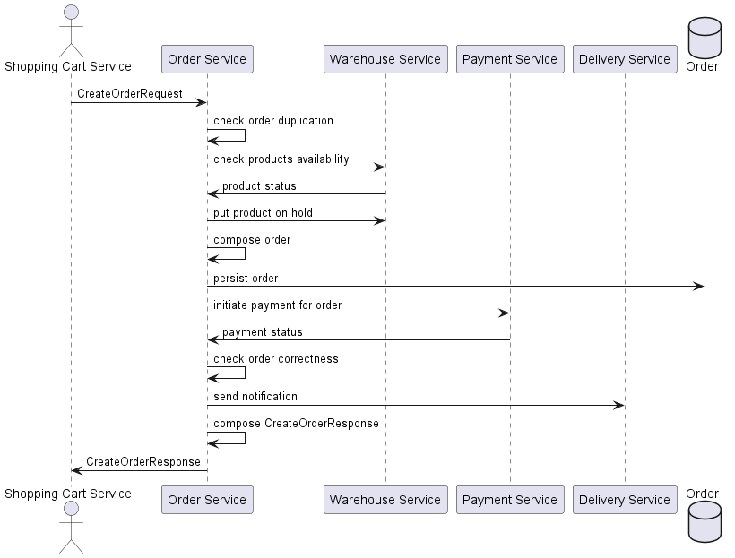

# Create Order Flow

## Case 1 - Happy Path Order Creation
The flow starts when the internal service sends request to `create order`. 
Received `CreateOrderRequest`, where specified necessary fields for order creation.
As part of this flow needs to `put product on hold`, `initiate payment`.

## Case 2 - Duplication Order Creation

## Case 3 - Product Not Available Order Creation

## Case 4 - Fail Payment Initiation Order Creation
