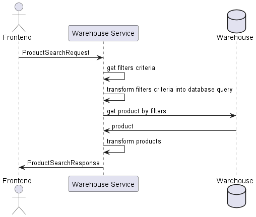
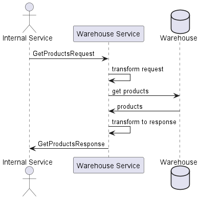

# Get Product Flow

## Case 1 - Get Single Product by Product Id

## Case 2 - Get Products by Search Params
When the user does search by `filter`, e.g. all `books`, `price` between `50` and `75`, status is `available`.

Obtain `ProductSearchRequest` with provided filters about desired product to explore 
and awaits the short info about all products that match filters. 

## Case 3 - Get Products by Product Ids
Need to provide ability to get all products information by product ids, 
when the other services need to make manipulation with products, e.g. for creation of order.

Need to provide all products that are requested with proper information.

Obtain `GetProductsRequest` with provided identifiers of desired products.

