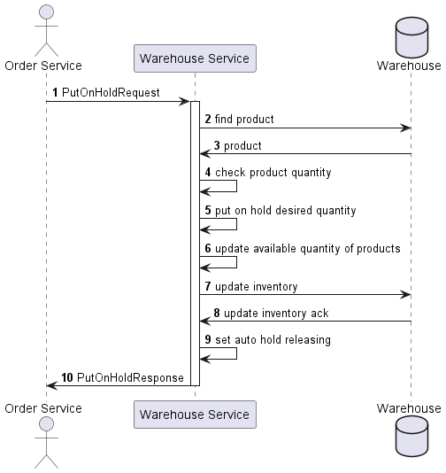
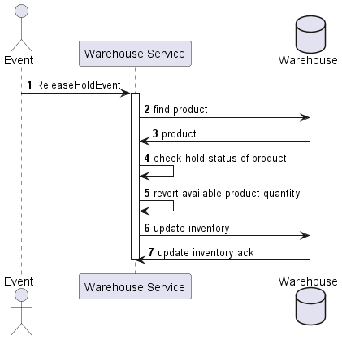
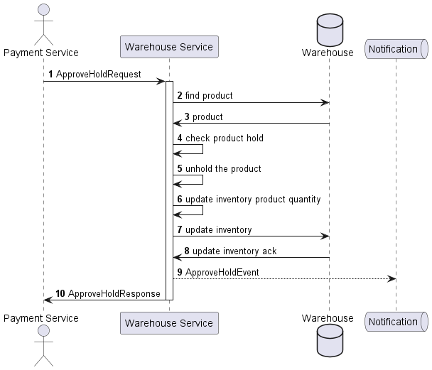

# Hold Product Flow

## Case 1 - Put On Hold
When a user sends a request to create an order
but has not paid it yet, we need to put on hold
(e.g. make the reservation) inventory items that
the user wants to buy.

Obtains `PutOnHoldRequest` to put on hold the products.

## Case 2 - Release Hold
If the user doesn't pay the order,
then we need to release these hold inventory
items to make them able to be bought by other users.

Releases automatically after configured time is expired, for example 5 minutes.
Releases manually after event is occurred, e.g. user declined the order.

If hold does approve, then don't auto release the inventory items.

## Case 3 - Approve Hold
If the user does pay the order,
then hold inventory items should be approved
for the exact user, and won't be released.

Obtains `ApproveHoldRequest` to approve the hold inventory items.

Reacts on `ApproveHoldEvent` to approve the hold inventory items.

## Case 4 - Postpone Release Hold
If the user doesn't pay the order,
but we got the request to postpone releasing hold,
e.g. user needs time to get paid the order.

Reacts on `PostponeReleaseEvent` to approve the hold inventory items.
